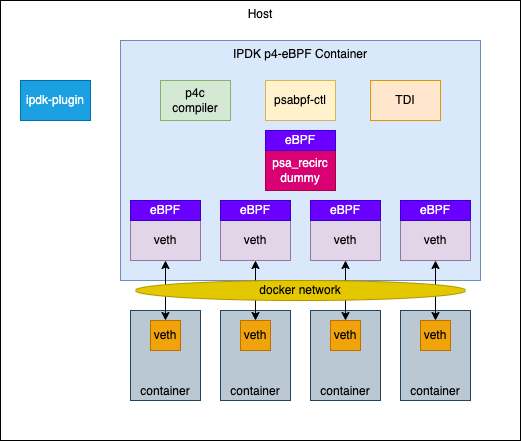

# IPDK Networking With eBPF

This directory contains the recipe for running IPDK networking with eBPF.

A high-level overview of the architecture is as follows:



## Running

### Bare Metal

If you want to run natively (on bare metal or in a VM), do the following:

```
$ sudo ./vagrant/provision.sh
$ sudo ./scripts/host_install.sh
```

### Vagrant

The recipe has a built-in Vagrant virtual machine. To run this, you can
simply do the following:

```
$ cd vagrant
$ vagrant up
```

Once the machine is booted and provisioned, you can then login to the virtual
machine and finish running the recipe setup.

```
$ cd vagrant
$ vagrant ssh
$ /git/ipdk/build/networking_ebpf/scripts/host_install.sh
```

This will install the following components of the IPDK eBPF recipe:

* protobuf
* P4 compiler with eBPF PSA support
* psabpf CLI
* psa-ebpf-demo
* ipdk-plugin Docker CNI

## Docker Instructions

See the [README_DOCKER.md](README_DOCKER.md) for Docker specific instructions.
