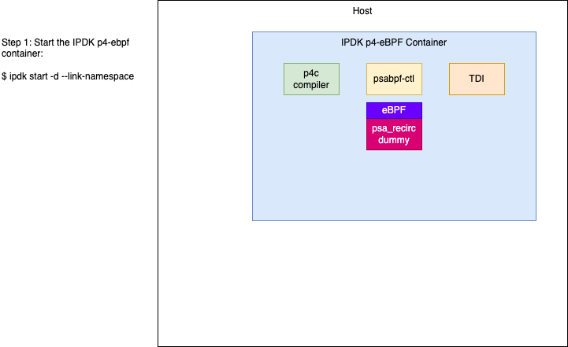
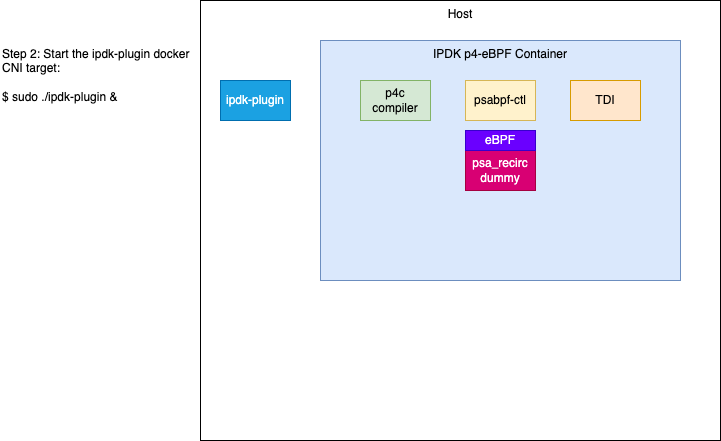
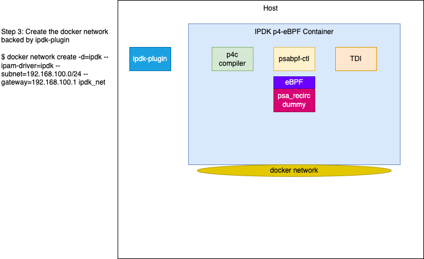
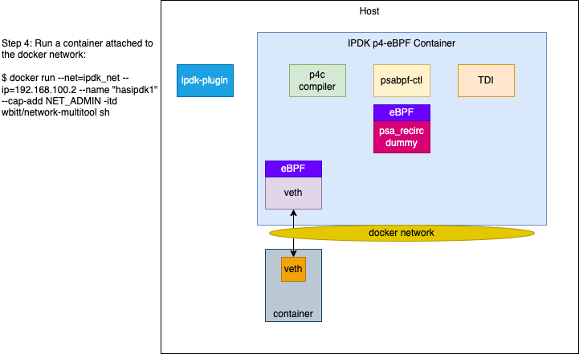
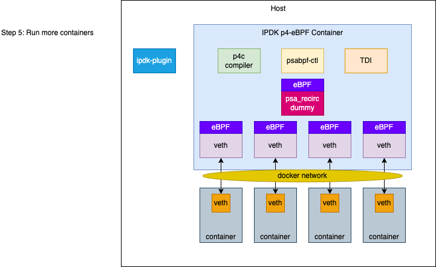

# IPDK Container (Version 0.1.0)

## What is the IPDK eBPF container?
The IPDK Container is a Virtual Networking Infrastructure Container and is
built with the following components:

1. [p4c compiler](https://github.com/p4lang/p4c)
2. [p4c eBPF backend](https://github.com/p4lang/p4c/tree/main/backends/ebpf)
3. [p4c eBPF PSA implementation](https://github.com/p4lang/p4c/tree/main/backends/ebpf/psa)
4. [psabpf CLI](https://github.com/P4-Research/psabpf)
5. [PSA eBPF Demo](https://github.com/P4-Research/psa-ebpf-demo)
6. [IPDK Docker CNI](https://github.com/mestery/ipdk-plugin)

The IPDK container dockerfile builds all the five components and their dependencies
and integrates them providing a P4 based virtual networking switch, P4
compiler + builder and example p4 pipeline code within the container. Following
sections decribe the steps on how to bring up and run this container and use
the example P4 pipeline programs.

## Optional Vagrant Setup

To ease usage of the IPDK P4OVS container, a Vagrant environment is provided
which will spinup an Ubuntu VM with Docker already installed, allowing for a
quick way to play with the containerized version of P4OVS.

### Supported Vagrant + Virtualbox Setups

The Vagrant setup is currently only tested with Virtualbox running on MacOS. As
more uses test and report things working, this will be updated.

It's also not advised to run multiple hypervisors at the same time, as this can lead
to trouble with sharing the CPU's virtualization extensions.

### Bringup the Vagrant VM:
```
$ cd vagrant
$ vagrant up
```

### Login to the VM
```
$ vagrant ssh
Welcome to Ubuntu 20.04 LTS (GNU/Linux 5.4.0-31-generic x86_64)

                  ubuntu-20.04-amd64-docker (virtualbox)
                 _____ _____ _____ _____ _____ _____ _____
                |  |  |  _  |   __| __  |  _  |   | |_   _|
                |  |  |     |  |  |    -|     | | | | | |
                 \___/|__|__|_____|__|__|__|__|_|___| |_|
                       Sat May 23 14:38:33 UTC 2020
                            Box version: 0.1.1

  System information as of Wed 22 Dec 2021 05:47:40 PM UTC

  System load:  1.08               Processes:                141
  Usage of /:   12.1% of 38.65GB   Users logged in:          0
  Memory usage: 3%                 IPv4 address for docker0: 172.17.0.1
  Swap usage:   0%                 IPv4 address for eth0:    10.0.2.15

vagrant@ubuntu2004:~$
```

From here on, make sure to follow the instructions below while logged into
the vagrant-container virtual machine.

### Build the IPDK p4-eBPF container

```
$ cd /git/ipdk/build
$ ./ipdk install ebpf-ubuntu2004
```

Follow the instructions to update your PATH variable.

Now, build the container:

```
$ ipdk build
```

## Using the P4-eBPF Docker Setup

The demo environment created will have all of the following components:


To run the demo, make sure you are on the system where you built the ipdk
P4-eBPF container. Go to the `network_ebpf` directory and run the following
commands:

```
$ make start-demo
```

To tear all the demo components down, run the following command:

```
$ make stop-demo
```

The demo environment and setup executes the following in order:







# Copyright

Copyright (C) 2021 Intel Corporation

SPDX-License-Identifier: Apache-2.0
