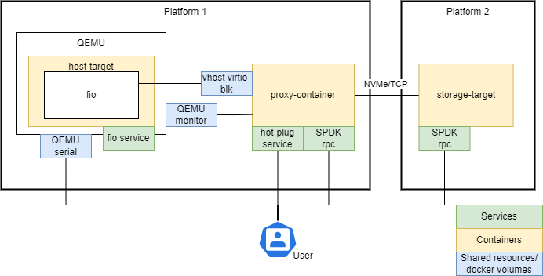

# Supported recipes
Currently, the following scenarios are represented:

* [hot-plug](./hot-plug.md) - describes how to deploy containers between
different machines and demonstrates virtio-blk hot-plug to a running host.
* [fio](./fio.md) - extends `hot-plug` scenario and describes how to run
fio traffic by means of `host-target` container through a hot-plugged virtio-blk
device.

In both cases host target platform is implied as KVM.

The picture below demonstrates the configuration exercised in these recipes

