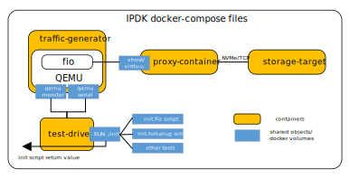

# Introduction
This recipe show-cases hot-plugging virtio-blk device into a VM and running
fio traffic from that VM using virtio-blk interface to a storage target
using NVMe/TCP protocol.

The scenario is realized using docker-compose in a single host environment.
The figure below illustrates the design:



There are three basic containers:
- _traffic-generator_ which plays the role of a "host" and runs the VM
- _proxy-container_ which plays the role of an IPU and exposes the block device
- _storage-target_ which plays the role of a remote storage node

In addition, there is a _test-drivers_ container used to exercise the scenario by running
dedicated tests.

# System setup
The basic requirement for running the recipe is a modern Linux distribution with docker support.
So far, the recipe has been successfully tested on the following systems:
- Fedora 33
- Ubuntu 18.04

To run the recipe some basic system preparations are required, in particular:

## Virtualization support
Make sure that VT-x/AMD-v support is enabled in BIOS
```
$ lscpu | grep -i virtualization
Virtualization:                  VT-x
```
and that kvm modules are loaded
```
$ lsmod | grep -i kvm
kvm_intel             217088  0
kvm                   614400  1 kvm_intel
irqbypass              16384  1 kvm
```

## Tool installation
Make sure that following tools are installed on your system or install them
using the corresponding package manager.

### wget
Installation on Fedora
```
$ sudo dnf install wget
```
or on Ubuntu
```
$ sudo apt install wget
```

### docker
```
$ sudo dnf install docker
```
or
```
$ sudo apt install docker
```
**Note:**
Make sure that required proxy settings are configured for docker.
Please, refer to [this](https://docs.docker.com/config/daemon/systemd/#httphttps-proxy) page.

### docker compose
```
$ sudo curl -L "https://github.com/docker/compose/releases/download/1.29.2/docker-compose-$(uname -s)-$(uname -m)" -o /usr/local/bin/docker-compose
$ sudo chmod +x /usr/local/bin/docker-compose
$ sudo ln -s /usr/local/bin/docker-compose /usr/bin/docker-compose
```

### libguestfs-tools
```
$ sudo dnf install libguestfs-tools-c
```
or
```
$ sudo apt install libguestfs-tools
```

**Note:**
To run `libguestfs` tools without root privileges, you may need to workaround the problem of
Linux kernel image not being readable by issuing:
```
$ sudo chmod +r /boot/vmlinuz-*
```

## Setting security policies
Make sure that required security permissions are configured to enable VM network connectivity
or disable them temporarily.
On Fedora SELinux can be disabled by means of the following command
```
$ sudo setenforce 0
```
For Ubuntu AppArmor is often used and can be disabled by issuing
```
$ sudo systemctl stop apparmor
```

# Running the tests
In order to run all defined tests
```
$ ./run.sh
```
or if there is a proxy
```
$ https_proxy=<https_proxy> \
http_proxy=<http_proxy> \
no_proxy=<no_proxy> \
./run.sh
```

To run a specific test
```
$ ./run.sh <name_of_test>
```
for example
```
$ ./run.sh hot-plug
$ # or
$ ./run.sh fio
```
The script `run.sh` returns a non-zero value only in case of an error.

**Note:**
The script `run.sh` will download a `Fedora 33` image into `traffic-generator`
directory and set up login-password pair as root-root if there is no `vm.qcow2`
image provided in that directory. `run.sh` will also try to allocate 2048 2MB
hugepages if not yet allocated and it will request administrative privileges
to execute this operation.
